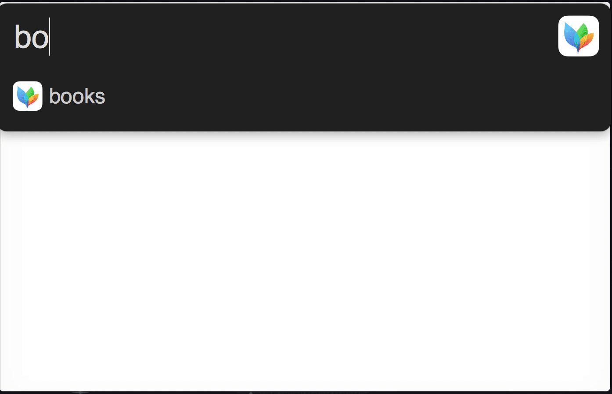

# Alfred My Mind🎗  
> [Alfred](https://www.alfredapp.com/) workflow to search through my notes and bookmarks on the web

You can read why this workflow exists [here](https://nikitavoloboev.gitbooks.io/knowledge/content/meta/my-mind.html). 

Essentially you can search through entirety of [my wiki](https://nikitavoloboev.gitbooks.io/knowledge/content/), all of [my mind maps](https://my.mindnode.com/myLVaRLKytoTYBLshxGzzb75MN9cyGHbQBgaVVPp#323.6,381.4,3) which include super fast access to various books, courses, blogs, research papers, reddit subreddits, stack exchange sites and more that I use to move and learn things faster.

As this workflow is focused and optimised for fast access to all the knowledge and references I have indexed. It would make sense to read through the wiki I made and maintain [here](https://nikitavoloboev.gitbooks.io/knowledge/content/) first.

My goals with sharing both this workflow and my [wiki knowledge base](https://nikitavoloboev.gitbooks.io/knowledge/content/) is to extend my idea of [knowledge bootstrapping](https://medium.com/@NikitaVoloboev/knowledge-bootstrapping-36c97e0dee19#.udmp9eotg) and tapping into a person's expertise in the most transparent way possible.

## Installing
Download the workflow from [GitHub releases](https://github.com/nikitavoloboev/alfred-my-mind/releases/latest).

### Small Demo 

## Contributing
[Suggestions](https://github.com/nikitavoloboev/alfred-my-mind/issues) and pull requests are highly encouraged!

This workflow heavily leverages curated lists from [Learn Anything](https://learn-anything.xyz/) that can be found [here](https://github.com/learn-anything/learn-anything/wiki/Curated-Lists). You can contribute directly to those lists so everyone benefits. 

## Thank you 💜
You can support what I do on [Patreon](https://www.patreon.com/nikitavoloboev) or look into [other repositories](https://my.mindnode.com/ZKGETDkUaQUsL3q8q9z788CxG84oEHgDiT79GuzX#-143.5,-902.6,0) I shared. 

## License
MIT © [Nikita Voloboev](https://www.nikitavoloboev.xyz)
